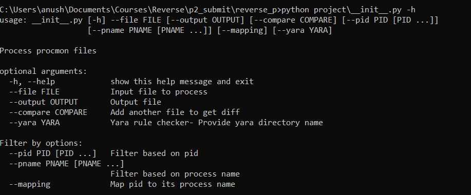

# ProcMon Automation Tool 

### Problem Statement
During the behaviour analysis of the malware, its often run through a sandbox to collect the behavioural data. Manually parsing through all of this data might lead to increased effort and there is a high possibility of missing crucial information.
Additionally, a malware analyst would wish to run the same malware sample multiple times after patches inorder to check for a difference in behaviour. With a huge amount of sandbox information, getting the difference in the malware behaviour would require adding filters and calculating difference between log files. Our automation tool is a simple command line parser designed to tackle these issues without much manual effort.

### The Automation Tool
#### Information Collection
ProcMon is a windows sysinternals tool developed by microsoft to collect system information. It primarily collects File, Registry, Process and Network information of the complete system. It helps users get a holistic view of the system behaviour during a certain period of time. But since procmon collects data about the entire system, there will be a lot of irrelevant data that needs to be filtered out.<br/>
Our tool collects the procmon log file in the form of a csv and outputs the information critical to an analyst.
The information filtered is as follows: <br/>
* File - File Create, File Delete
* Process - Process Create, Process Exit
* Registry - Registry Create Key, Create Value, Delete key, Delete Value 
* Network - TCP Connect, Send, Receive, Reconnect 
<!-- end of the list -->
If the following events are encountered in procmon logs, our tool collects the following information for the event:<br/>
* Process ID <br/>
* Process Name <br/>
* Event Information[For ex: Key name or IP address etc]<br/>
<!-- end of the list -->
This gives us a clear picture of the actions taken by the process that we wish to monitor 
<br/>

#### Filter Data 
Our tool provides an approach to filter out data based on a list of PIDs and Process names. This feature enables us to specifically monitor a target process behaviour.

#### Log Difference generator
One key feature of this tool is that it takes two procmon log files as input and generates a difference between them. This difference can be viewed in a html page [ Similar to git difference]. This feature makes it easy for a malware analyst to quickly look up the difference between two executions of the same malware. **It can be combined with the filter feature above to achieve better scrutiny.**<br/>
**Note**- Process ID adds entropy to the data during multiple executions. Hence, its not considered as a factor while generating the diff.

#### YARA rule parser
One additional feature of this tool is, It takes in a couple of yara rule files and tries to match them across the existing logs. If there is a match, then the tool displays the rule and the corresponding log lines which triggered the match. An analyst can use this feature to check for already existing malware behaviours.

### Usage

The tool is developed using Python 3.8. The tool runs as a package. Here are the steps to run the tool 

1. Install latest python 3
2. Move to the directory containing setup.py
3. perform pip install requirements.txt [ We need YARA python to be installed for the tool to function. It can also be installed using ```pip install yara-python```]
    * **Note** If yara-python fails to install from pip, install it from git source present here https://github.com/VirusTotal/yara-python
4. Build our tool package using ```pip install .```
5. Run the tool: 
    * View the tool help
    ```
      python project\__init__.py -h 
    ```
    
    * To just get critical information from a file run<br/>
    ```
      python project\__init.py__ --file test.csv --output out.log
   ```
    * To filter data based on PID [ takes multiple PIDs seperated by space]<br/>
    ```
      python project\__init.py__ --file test.csv --pid 2136 2504
    ```
    * To filter data based on Process name [ takes multiple process names seperated by space]<br/>
    ```
      python project\__init.py__ --file test.csv --pname final_u.exe explorer.exe
   ```
   
    * To filter data based on Process name and its corresponding process ID<br/>
    ```
      python project\__init.py__ --file test.csv --mapping --pname final_u.exe --pid 2136
   ```
   
    * To compare two csv files - The result will be stored in compare.html file in the same directory. <br/>
    ```
      python project\__init.py__ --file test2.csv --pname final_u.exe --compare test3.csv
   ```
    * **Note** : Compare with pid or pname will compare only the subset of data containing the matching pid or process name in both the files. So it is not recommended to use compare with Process ID because the Process ID will change everytime the executable is run.
    
    * To run the data across the exisiting yara rules 
    ```
      python project\__init.py__ --file test2.csv --yara yara
    ```
<br/>
   
### Future Work
This tool can be improved to support automatic sandbox data collection. The tool currently expects csv files exported from ProcMon log files. So the process of converting PML files to csv files can be added to the tool. Additionally, procmon data collection can be automated. This will enable us to develop a pipeline which spawns a sandboxed environment with our tool. Malware execution and report generation can be automated as well.
The current structure of the tool also makes it easy add additional feature detections[ For ex: File modifications, Registry Rename etc]


### Limitations
Our tool is heavily dependent on ProcMon logs. ProcMon is very strong in terms of data collection but its driver operates at a lower altitude. So if a rootkit with higher driver altitude is installed then procmon will not be able to capture those logs. Additionally, ProcMon itself offers variety of filters which the tool fails to provide.

### Conclusion
Automated behaviour analysis tools aid  in malware analysis process by reducing few repetitive tasks. Such tools when enhanced can provide advanced intelligence and detection capabilities.

### References
* https://docs.microsoft.com/en-us/sysinternals/downloads/procmon
* https://www.ghettoforensics.com/2016/01/creating-malware-sandbox-in-seconds.html


